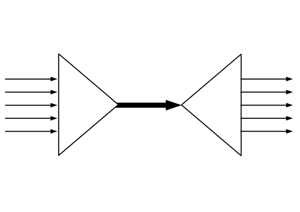

# ***s***imple ***mu***ltiple***x***ing
[![GoDoc][1]][2] [![MIT licensed][3]][4] [![Build Status][5]][6] [![Go Report Card][7]][8] [![Coverage Statusd][9]][10]

[1]: https://godoc.org/github.com/xtaci/smux?status.svg
[2]: https://godoc.org/github.com/xtaci/smux
[3]: https://img.shields.io/badge/license-MIT-blue.svg
[4]: LICENSE
[5]: https://travis-ci.org/xtaci/smux.svg?branch=master
[6]: https://travis-ci.org/xtaci/smux
[7]: https://goreportcard.com/badge/github.com/xtaci/smux
[8]: https://goreportcard.com/report/github.com/xtaci/smux
[9]: https://codecov.io/gh/xtaci/smux/branch/master/graph/badge.svg
[10]: https://codecov.io/gh/xtaci/smux

## Features
1. Token controlled receive buffer.
1. Receive buffer is shared among streams.
1. Minimized header, mobile friendly design.

## Status
Alpha
